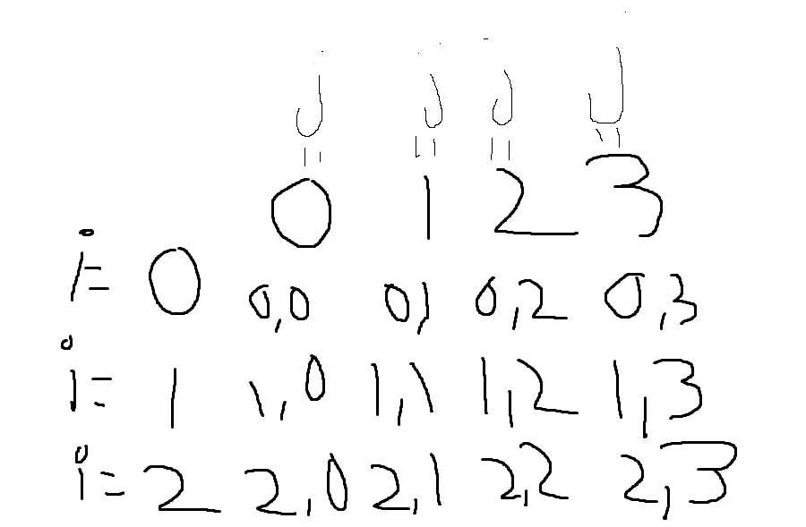

## P1: Arrays
### EX_03

En este ejercicio tendremos que crear un array multidimensional haremos 2 bucles para hacer el print de cuyo array de forma que podamos imprimir las filas y columnas.

Un ejemplo del bucle un for será la "i" y el otro la "j" en este caso la "j" está dentro de la "i" que esta serviría como para un salto de línea por decirlo de alguna form.

Crear una variable "suma_total" se verá mas adelante.

En el primer for crearemos una variable "suma_fila" se ocupará de sumar las posiciones de las filas para dar el valor total de cada un todo esto en el primer bucle, ya que si lo creamos en el otro no podríamos sacar la variable de ese bucle. El que asignara los valores será el for de la "j" cuyo código será una variable asignada a un número random que más adelante se le asignara a la posición de la array (numeros[i][j]= random).

Haremos un print del número que acabamos de asignar en el array y empezaremos hacer el cálculo de la suma de manera interna no se mostrara aún el cálculo será el siguiente "suma_fila = suma_fila + numeros[i][j];"
se irá sobrescribiendo el valor continuamente sumando todas las posiciones de esa fila.

Al acabar el recorrido de este array se saldrá y empezará ha hacer el recorrido del array "i" que tiene líneas de código al final que se ejecutan hasta que se acabe el bucle de "j" aquí usaremos la variable que hemos creado antes la "suma_total" cuya variable almacenará todas las sumas de cada fila columna, ahora estamos con las filas hacemos que " suma_total = suma_total+suma_fila;" suma_total tendrá el valor de la fila[i] si hacemos esto en cada bucle al final tendrá el valor de todas las filas, después de este cálculo haremos un salto de línea para la próxima fila.

Crearemos un bucle para sumar las columnas y las hace el cálculo de la suma total,
creamos la variable "suma_columnas" la operación será la siguiente: suma_columna=numeros[0][i]+numeros[1][i]+numeros[2][i]+numeros[3][i];, de esta forma no suma todas las columnas de todas las filas y hacemos que lo imprima "System.out.print("["+suma_columna+"]");" y para saber el calculo final será :   suma_total=suma_total+suma_columna; (suma_total tiene el valor de suma_filas entonces esta sumando todas las filas + todas las columnas), y fuera de todos los bucles lo imprimimos System.out.println("["+suma_total+"]");